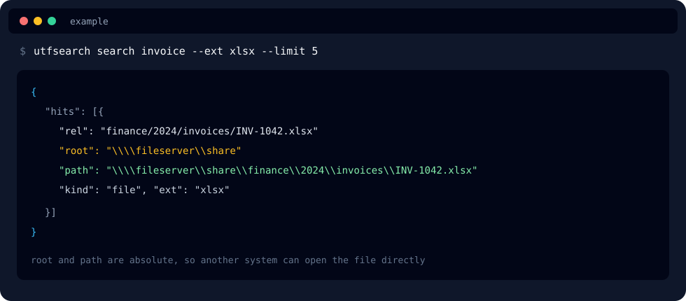
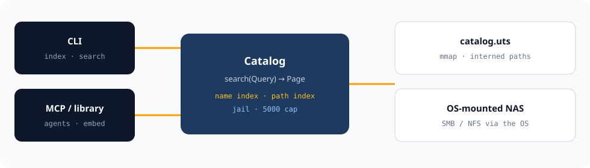

<p align="center">
  
</p>

<h1 align="center">UTFsearch</h1>

<p align="center">
  <strong>A local catalog for file names and paths.</strong><br/>
  Index a folder once. Search it without walking the live tree.
</p>

<p align="center">
  
  
  
  
</p>

---

本機檔名／路徑搜尋。第一次 `index --root`，之後 `search`。結果裡的 `root` 與 `path` 都是絕對路徑，方便接到其他系統。

## What it is

UTFsearch is a **metadata catalog**, not a content search engine and not a SQL database.

It walks operator-declared Roots, stores names, paths, sizes, times, and owners, then answers from a memory-mapped `catalog.uts`. Queries never re-list the live disk.

| Need | Behavior |
| --- | --- |
| Mixed-script names | Unicode-normalized filename index |
| Agent / script use | Same `Catalog::search` via CLI or MCP |
| Hand a result to another system | Absolute `root` and `path` on every hit |
| Keep scans cheap | Skip OS noise and package trees (`node_modules`, `.venv`, `build`, …) |

## Example result

Illustrative hit shape (fictional share). `path` is what another program opens.



```json
{
  "rel": "finance/2024/invoices/INV-1042.xlsx",
  "root": "\\\\fileserver\\share",
  "path": "\\\\fileserver\\share\\finance\\2024\\invoices\\INV-1042.xlsx",
  "kind": "file",
  "ext": "xlsx"
}
```

## Quick start

```text
cargo build -p utfsearch --release
utfsearch index --root D:\Share
utfsearch search invoice
utfsearch search --ext xlsx --after 2024-01-01 --limit 1000
utfsearch refresh
```

- `--root` only on the first index. Later commands reuse Roots stored in the catalog.
- `--catalog` is optional (default: `catalog.uts` beside the exe).
- `--limit` defaults to 200, maximum 5000.
- Bare `search <text>` matches **filename** only. Use `--path` to search the relative path.

## Architecture

Index writes the catalog. Search only reads it.



CLI and MCP are adapters. They do not contain a second engine.

## Extensibility

| Surface | Role |
| --- | --- |
| CLI | Operators and scheduled refresh |
| `utfsearch mcp` | MCP hosts over stdio |
| `utfsearch-core` | Embed `Catalog::search` in another binary |
| Hit.`path` | Pass a real filesystem path to ERP, a viewer, or a workflow |

## Security

- Only declared Roots are visible
- Every emitted path is jailed
- No file-content read, no unbounded regex, no default network listener

[SECURITY.md](SECURITY.md)

## License

[MIT](LICENSE)
