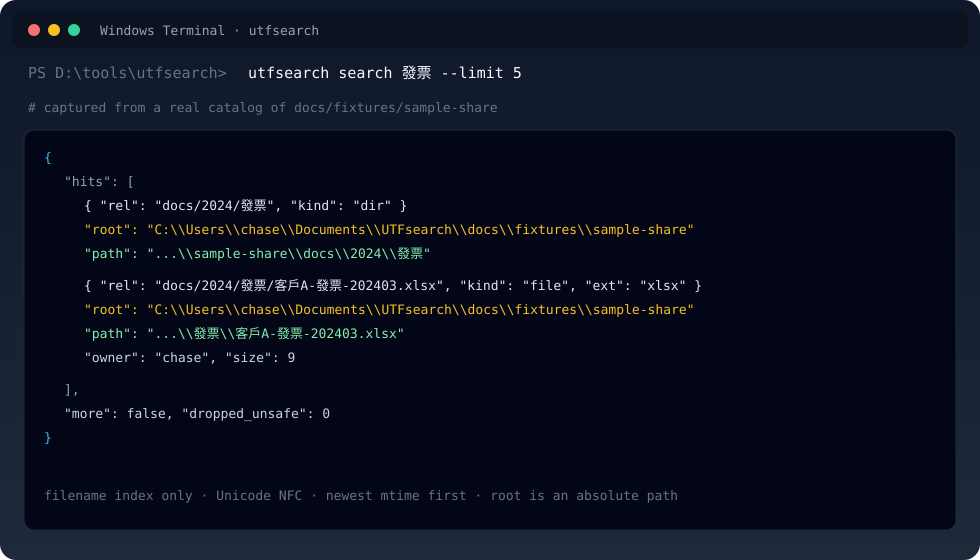
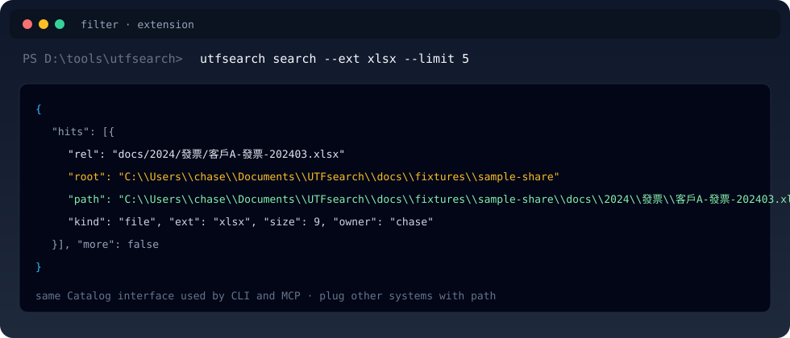

<p align="center">
  
</p>

<p align="center">
  
</p>

<h1 align="center">UTFsearch</h1>

<p align="center">
  <strong>Local-first path catalog for humans and agents.</strong><br/>
  Find a file among tens of millions of deep, mixed-script names — without walking the live NAS.
</p>

<p align="center">
  
  
  
  
</p>

---

中文使用者：這是給檔名／路徑用的本機搜尋引擎。第一次 `index --root`，之後 `search 發票`。結果裡的 `root` 與 `path` 都是絕對路徑，方便接 ERP、agent 或其他系統。

## Why it exists

Shared drives and NAS trees are deep, multilingual, and too large to `dir /s` on every question. UTFsearch builds a compact catalog of **metadata only**, then answers from that catalog.

| You have | UTFsearch does |
| --- | --- |
| 30M files on an OS-mounted share | One local `catalog.uts`, mmap'd at query time |
| CJK / accented / mixed names | Unicode-normalized filename index (NFC, Windows case-fold) |
| An AI agent that must not wander | Jail: only operator Roots, no file-content read |
| Another system that needs a real path | Each hit carries absolute `root` + `path` |

It is **not** a content search engine and **not** a SQL warehouse. That is deliberate: a path catalog is a dictionary problem.

## Real search output

These panels are drawn from a live run against [`docs/fixtures/sample-share`](docs/fixtures/sample-share) on this machine.

**Filename search** (`utfsearch search 發票 --limit 5`) — hits the CJK name, not a live walk:



**Filter by extension** (`utfsearch search --ext xlsx --limit 5`) — same catalog, different Query:



Every hit is ready to plug elsewhere:

```json
{
  "rel": "docs/2024/發票/客戶A-發票-202403.xlsx",
  "root": "C:\\Users\\chase\\Documents\\UTFsearch\\docs\\fixtures\\sample-share",
  "path": "C:\\Users\\chase\\Documents\\UTFsearch\\docs\\fixtures\\sample-share\\docs\\2024\\發票\\客戶A-發票-202403.xlsx"
}
```

`root` is the full Root directory. `path` is the full file path. Downstream tools do not need a second lookup.

## 60-second start

```text
cargo build -p utfsearch --release
utfsearch index --root D:\資料
utfsearch search 發票
utfsearch search --ext xlsx --after 2024-01-01 --limit 1000
utfsearch refresh
```

- `--root` is first-run only. Roots are stored in the catalog.
- `--catalog` is optional. Default is `catalog.uts` next to the exe.
- `--limit` is yours to set (default 200, hard max 5000).
- Default `search <text>` matches **filename** only. Use `--path` for the relative path.

## What it skips (so scans stay useful)

By default it does not descend into noise:

- OS: `$Recycle.Bin`, `System Volume Information`, `C:\Windows`, `Program Files`, SYSTEM-attribute files
- Tooling: `node_modules`, `.venv` / `venv`, `__pycache__`, `build`, `dist`, `target`, `vendor`, `.git`

Override with `--include-system` only if you truly need those trees.

## Architecture

<p align="center">
  
</p>

One deep module, two adapters:

```text
CLI  ──┐
       ├──  Catalog::search(Query) → Page   ──  catalog.uts (mmap)
MCP  ──┘
```

- **Interned path components** — 30M full strings are not stored as 30M strings
- **Separate name and path trigram indexes** — filename search does not scan path postings
- **Directory mtime prune** on `refresh` — unchanged trees are copied, not re-walked
- **Atomic replace** — readers never see a half-written catalog

## Extensibility

| Surface | Use it when |
| --- | --- |
| CLI | Operators, Task Scheduler, scripts |
| `utfsearch mcp` | Cursor / Claude / other MCP hosts (stdio; HTTP needs a token) |
| `utfsearch-core` crate | Embed `Catalog::search` in another Rust binary |
| Hit.`path` | Hand the absolute path to ERP, a viewer, or a workflow |

Adding a new protocol is another adapter. It should not grow a second engine.

```rust
let page = catalog.search(Query { name: Some("發票".into()), limit: 200, ..Query::new() })?;
for hit in page.hits {
    // hit.path is the absolute location another system can open
}
```

## Security posture

- Deny-by-default Roots
- Lexical jail on every emitted path
- No `read_file`, no regex, no default network listener
- Catalog file is metadata only (paths can still be sensitive)

See [SECURITY.md](SECURITY.md).

## Project map

| | |
| --- | --- |
| Engine | `crates/utfsearch-core` |
| CLI + MCP | `crates/utfsearch` |
| Domain language | [`CONTEXT.md`](CONTEXT.md) |
| Spec / plan | [`specs/001-utfsearch-catalog/`](specs/001-utfsearch-catalog/) |
| Brand | [`docs/brand/`](docs/brand/) |

## License

[MIT](LICENSE) · Copyright 2026 TunaPig1228
